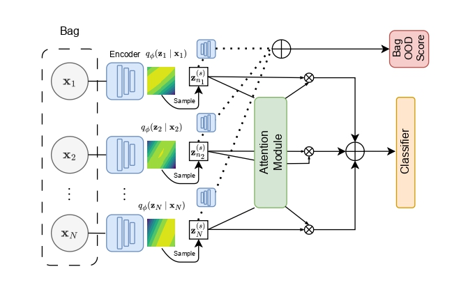

# [Using Variational Autoencoders for Out of Distribution Detection in Histological Multiple Instance Learning](https://ieeexplore.ieee.org/document/11098836/)

> **⚠️ Warning: Recommended Implementation**  
> For the most up-to-date and feature-rich version of VAEABMIL, we recommend using the implementation available in the [torchmil](https://github.com/franblueee/torchmil) library under `torchmil.models.VAEABMIL`. This repository contains the original implementation from the paper but may not include the latest enhancements.

This repository contains the original implementation of the VAEABMIL model as described in the paper.

## Model Description

VAEABMIL (Variational Autoencoder - Attention-based Multiple Instance Learning) is a deep learning model designed for Multiple Instance Learning (MIL) tasks, particularly in histological image analysis for out-of-distribution (OOD) detection. The model jointly trains a Variational Autoencoder (VAE) on instance features to learn a latent representation that is used for attention-based multiple instance learning and to detect OOD instances and bags.

Key features:
- **VAE Integration**: Uses a VAE to encode instance features into a latent space, enabling OOD detection.
- **Attention Mechanism**: Employs attention-based pooling to aggregate instance-level features into bag-level representations.

## Citation
If you use this work, please cite:

@article{saez2025using,
  title={Using Variational Autoencoders for Out of Distribution Detection in Histological Multiple Instance Learning},
  author={S{\'a}ez-Maldonado, Francisco Javier and Garc{\'\i}a, Luz and Cooper, Lee AD and Goldstein, Jeffery A and Molina, Rafael and Katsaggelos, Aggelos K},
  journal={IEEE Access},
  year={2025},
  publisher={IEEE}
}
